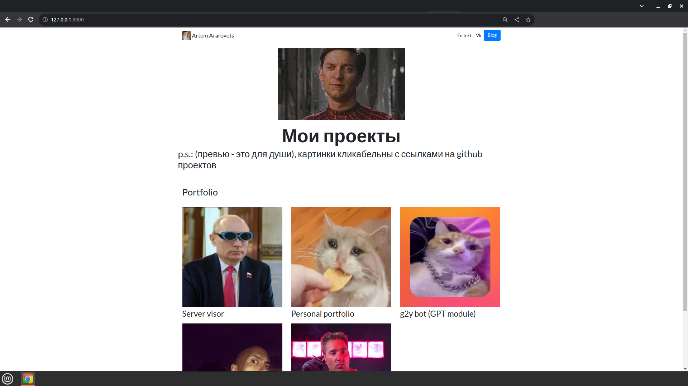

# Personal porfolio

## Краткое описание
Проект написанный на Django, отображение происходит через Jinja templates. 



## Использованные технологии

**Back часть:**  
- Python 3.10
- Django
- Jinja
- SQLite

**Front часть:**  
- HTML
- CSS

## Запуск
1) установите python и клонируйте репозиторий
2) Создайте и запустите виртуальное окружение:
```bash
python -m venv venv
source ./venv/bin/activate
```

3) Установите зависимости в виртуальное окружение:  
```bash
pip install -r requirements.txt
```

4) Запустите проект:  
```shell
python manage.py runserver
```

5) Перейдите по ссылке: http://localhost:8000/  

## Доп. описание
Не надо делать `python manage.py migrate && python manage.py makemigrations`, т.к. в репозитории уже содержится база данных с созданными проектами и постами.  
  
Получить доступ к админ панели (http://localhost:8000/admin/):  
Логин: `admin`  
Пароль: `123`  